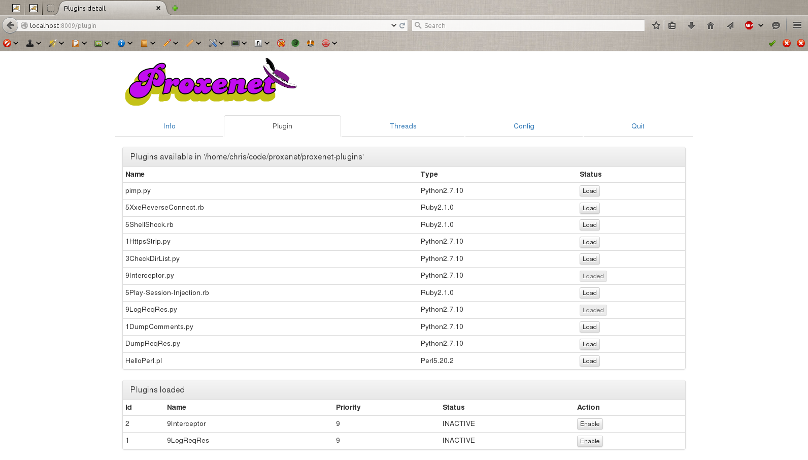

# Controlling proxenet

Every `proxenet` session creates a control socket. This socket is a Unix socket
(`AF_UNIX`) and by default by to `/tmp/proxenet-control-socket`.

Using this socket, `proxenet` provides 3 ways to be controlled.


## Raw client

The most basic way to connect and interact with `proxenet`, is simply by using a
`netcat` (or equivalent) tool.

```bash
$ nc -U /tmp/proxenet-control-socket
```

This interface is extremely basic, but provides all the features configurable in
`proxenet`. However, the response will be formatted in JSON, which may not make
it easy to read and understand for a human.

So from here, you can either build your own client in the language of your
choice, or use the one Python client provided.


## Python terminal client

The Python control client for `proxenet` does **not** require any dependencies,
as all the libraries used are built-in with any Python > 2.5.

```bash
$ python /path/to/proxenet/control-client.py
```


## Web interface

The most user friendly way to interact with `proxenet` is through the web
interface. The Python `control-web.py` will spawn a small web HTTP service that
will allow you to do all the same manipulations that the Python terminal client
allowed you to, but in a more Web App pentester friendly way.

The only requirement for this to work is `python-bottle`, which can be easily
installed through `pip`:

```bash
# pip install bottle                 # for a system-wide installation
$ pip install --user bottle          # for a user specific installation
```

And then, simply run
```bash
$ python /path/to/proxenet/control-web.py
```

By default, the HTTP service will be listening on TCP port 8009.


