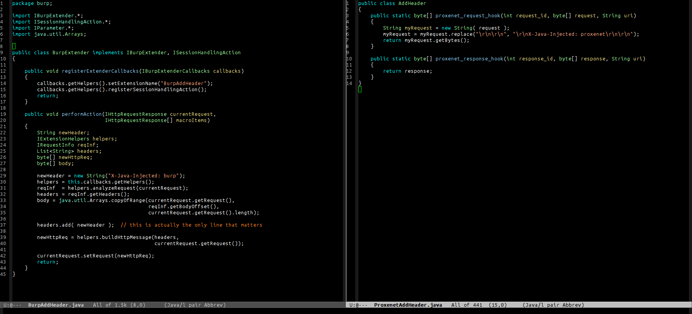

## Definition

From Ancient Greek, *πρόξενος* (*próksenos*, "public guest").

1. A negotiator; a factor; a go-between.
2. A mediator involved in immoral bargains (see *pimp*).

## What is proxenet ?

>
> `proxenet` is a **hacker** friendly proxy for web application
> penetration tests.
>

`proxenet` is a multi-threaded proxy which allows you to manipulate HTTP
requests and responses using your favorite scripting language. No need to learn
Java (like for [Burp](http://portswigger.net/burp/extender/)), or Python (like
for
[mitmproxy](http://mitmproxy.org/doc/scripting/inlinescripts.html)). `proxenet`
supports many languages (see the section "Language Versions") and more can
be easily added.

`proxenet` is **not** script kiddie friendly. While the tool can be configured
to use a web interface, it is not packaged with a GUI. If this is what you are
looking for, here are some script kiddie friendly alternatives:

- [ZAP](http://owasp.org/index.php/OWASP_Zed_Attack_Proxy_Project)
- [Burp](http://portswigger.net/burp)
- [ProxyStrike](http://www.edge-security.com/proxystrike.php)

Of course, the best way is to write your own GUI as a `proxenet` plugin!

## Why ?
The idea behind `proxenet` came after much frustration from attempting to write
extensions for Burp. Moreover, only a few existing proxies support the
possibility to add new extensions, and when they do, they typically only support one language.
This is not ideal for a penetration tester, as it compromises usability despite Burp's
persistent attempts to make unnatural bindings (Python over Java, or worse: Ruby over Java).

`Proxenet` is written in pure C, so it is **fast**, **efficient** and easily
pluggable to everything else. It is the ultimate real
[DIY](https://en.wikipedia.org/wiki/Do_it_yourself) web proxy for
pentesters.

## Features

Here's a sample of features already supported by `proxenet`:

- Written in C
    - Fast (heavy thread use)
    - Efficient (POSIX compatible)
    - Low memory footprint (for the core)
- Can interact with any language
- Provides plugins support for the following languages:
    - C
    - Python
    - Lua
    - Ruby
    - Perl
    - Tcl
    - Java
- SSL/TLS
    - Full SSL/TLS interception (internal CA)
    - SSL/TLS client certificate authentication
- IPv4/IPv6
- HTTP Proxy forwarding
- White-list/Black-list host filtering
- Command interface out-of-band
- Nice TTY colors :D
- 100% Open-Source
... and more!

## The best of both worlds ?

Some people might miss the beautiful interface some other GUI-friendly proxies
provide. So be it! Chain `proxenet` along with `Burp`, `Zap`, `Proxystrike`,
`burst`, etc. and enjoy the show!

## Write Your Own Plugins

If you've ever had the pleasure, you already know that writing extension for `Burp`
is a pain, and other tools only provide plugins, and when they do, only in the language
they were written in.

The simple and powerful idea behind `proxenet` is to allow pentesters to
**easily** interact with HTTP requests/responses in their favorite high-level language.

Take a look at the [Plugins](plugin) section for a quick guide on how to start
writing plugins.

## Plugin Binding Language Versions

The current version of `proxenet` has been tested with:

- Python 2.6+/3.x+
- Ruby 2.x
- Perl 5.1+
- Lua 5.2+
- Tcl 8.5+
- Java 1.6+

## Still not convinced?

Just to keep the troll alive, have a quick look at the comparison how to create
a very simple plugin using the `Burp` API, and the very same plugin using `proxenet`.
To make things fair, both are written in Java. ;)

*Note*: This troll is naturally totally unbiaised of course.

## Presentation

 - Ruxmon Melbourne Aug-2015 (https://blah.cat:8000/public/Ruxmon.2015-08.-.proxenet.pdf)

## Contributing

Report crashes or improvement patches using the GitHub issues page of the
project. This project follows the *beers4bugs* bounty policy.
