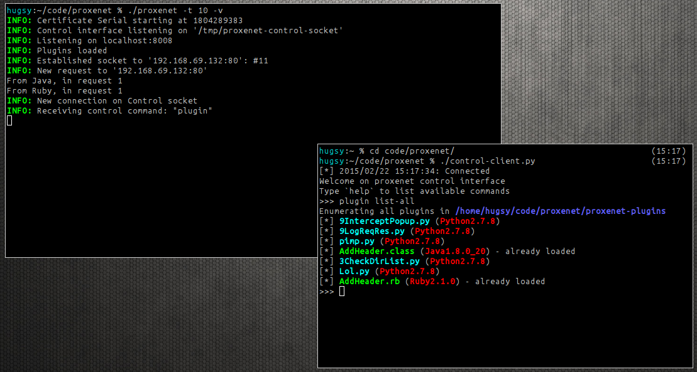

## Definition

From Ancient Greek, *πρόξενος* (*próksenos*, "public guest").

1. A negotiator; a factor; a go-between.
2. A mediator involved in immoral bargains (see *pimp*).

## What is proxenet ?

>
> `proxenet` is a **hacker** friendly proxy for web application
> penetration tests.
>

`proxenet` is a multi-threaded proxy which allows you manipulate your HTTP
requests and responses using your favorite scripting language. No need to learn
Java (like for [Burp](http://portswigger.net/burp/extender/)) or Python (like
for
[mitmproxy](http://mitmproxy.org/doc/scripting/inlinescripts.html)). `proxenet`
supports heaps of languages (see the section "Language Versions") and more can
be easily added.

`proxenet` is **not** script kiddie friendly, neither GUI friendly. If this is
what you are looking for, here are a few links for you

- [ZAP](http://owasp.org/index.php/OWASP_Zed_Attack_Proxy_Project)
- [Burp](http://portswigger.net/burp)
- [ProxyStrike](http://www.edge-security.com/proxystrike.php)

Or the best way, write your own GUI as a `proxenet` plugin !

## Why ?
The idea behind `proxenet` came after a lot of frustration from attempting to write
extensions for Burp. Moreover, only a few proxies already existing supports the
possibility to add new extensions. And when they do, they are (one) language
specific - despite Burp persistent attempts to make unnatural bindings (Python
over Java or worse Ruby over Java.

Being written in pure C, it is **fast**, **efficient** and easily
pluggable to anything else. It is the utimate real
[DIY](https://en.wikipedia.org/wiki/Do_it_yourself) web proxy for
pentest(ers).

## Features

Here are a sample of features already supported by `proxenet`:

- Written in C
    - Fast (heavy thread use)
    - Efficient (POSIX compatible)
    - Low memory footprint (for the core)
- Can interact with any language
- Provides plugins support for the following languages:
    - C
    - Python
    - Lua
    - Ruby
    - Perl
    - Tcl
    - Java
- SSL
    - Full SSL interception (internal CA)
    - SSL client certificate authentication
- IPv4/IPv6
- HTTP Proxy forwarding
- White-list/Black-list hosts filtering
- Command interface out-of-band
- Nice TTY colors :D
- 100% Open-Source

... and more !

## The best of both world ?

Some people might miss the beautiful interface some other GUI-friendly proxies
provide. So be it! Plug `proxenet` as a relay behind your favorite `Burp`,
`Zap`, `Proxystrike`, `burst`, etc. and enjoy the show!

## Write-Your-Own-Plugins

If you ever had to do, you already know that writing extension for `Burp` is a
pain and other tools only provide plugins (when they do) in the language they
were written in.

So the simple but powerful idea behind `proxenet` is to allow pentesters to
**easily** interact with their HTTP requests/responses in their favorite
high-level language.

Jump to section [Plugin](plugin) to start writing plugins now.

## Language Versions

The current version of `proxenet` has been tested with:

- Python 2.6+/3.x+
- Ruby 2.x
- Perl 5.1+
- Lua 5.2+
- Tcl 8.5+
- Java 1.6+

## Still not convinced ?

Just to keep the troll alive, have a quick look at the comparison how to create
a very simple plugin using `Burp` API and the very same plugin using `proxenet`,
both written in Java.

[burp-proxenet](img/fun.png)

*Note*: this troll is naturally totally unbiaised of course.

## Want to help

Report crashes or improvement patches using the GitHub issues page of the
project. This project follows the *beers4bugs* bounty policy.
